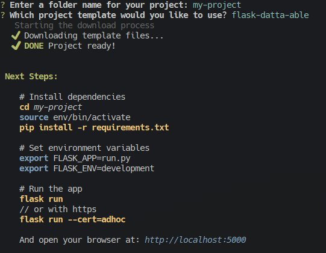

<p align="center">
    
</p>
<p align="center">
  AIO downloader for Appseed Project templates.
</p>
<p align="center">
   <a href="https://discord.gg/fZC6hup"></a> <a href="https://github.com/app-generator"></a>
  
</p>

## What is the utility of this CLI?
Simplify the instalation of a appseed (app-generator) project template.

## How it works?
<div align="center">
    
</div>

## Installation

1 - Download the **last** release.

2 - Follow the instructions on the release page.

3 - Enjoy!

## News🗞️

```
+ Updated to RUST
```
